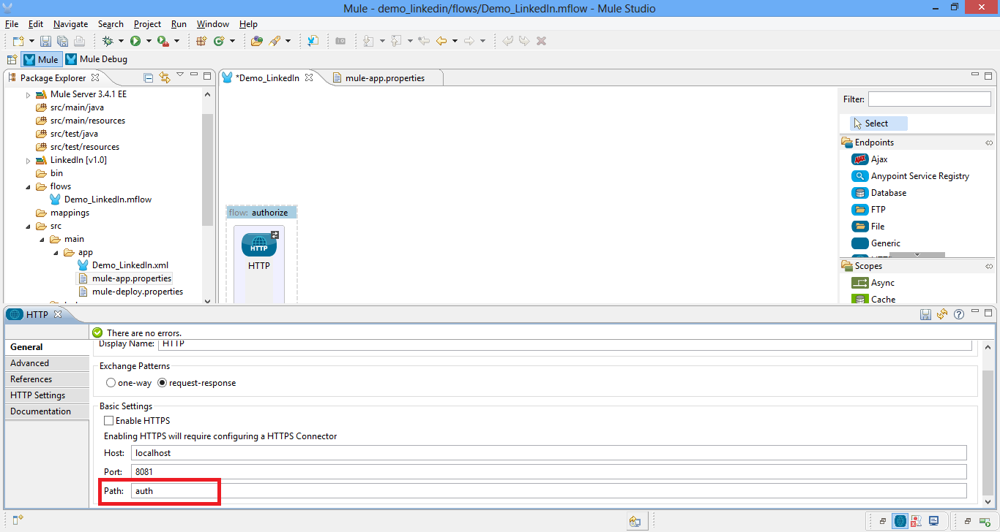
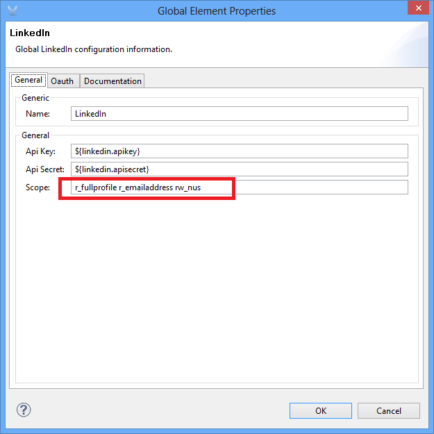
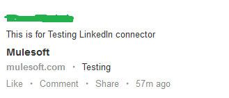

[Purpose](#purpose)

[Prerequisites](#prerequisites)

[Step 1: Create LinkedIn Developer account](#step-1-create-linkedin-developer-account)

[Step 2: Install Mule LinkedIn Connector from Update Site](#step-2-install-mule-linkedin-connector-from-update-site)

[Step 3: Create Demo Project](#step-3-create-demo-project)

[Step 4: Add Global Elements](#step-4-add-global-elements)

[Step 5: Create Authorize Flow](#step-5-create-authorize-flow)

[Step 6: Run Demo project](#step-6-run-demo-project)

[Step 7: Test Authorize Flow](#step-7-test-authorize-flow)

[Step 8: Create Get Profile Flow](#step-8-create-get-profile-flow)

[Step 9: Test Get Profile Flow](#step-9-test-get-profile-flow)

[Step 10: Create Post Share Flow](#step-10-create-post-share-flow)

[Step 11: Test Post Share Flow](#step-11-test-post-share-flow)

[Flow XML](#flow-xml)

[Other Resources](#other-resources)

### Purpose

This document provides detailed instructions on how to install MuleSoft's LinkedIn connector and demonstrates how to build and run simple demo application that uses this connector.

### Prerequisites

In order to build and run this project you'll need:

[Linkedin](http://Linkedin.com) account.

[MuleStudio](http://www.mulesoft.org/download-mule-esb-community-edition "MuleStudio.").

Web browser.

### Step 1: Create LinkedIn Developer account

- Create an account on [https://www.linkedin.com.](https://www.linkedin.com "https://www.linkedin.com")

- Log in to [https://www.linkedin.com.](https://www.linkedin.com. "https://www.linkedin.com.")

- Go to [http://developer.linkedin.com.](http://developer.linkedin.com/. "http://developer.linkedin.com/.")

**Click API Key** link at top right corner > **Add New Application** > Fill the form with mandatory details > Click **Add Application button** > note the **API Key** and **Secret Key** > Click **Done button**.

### Step 2: Install Mule LinkedIn Connector from update Site

- In Mule Studio select **Help > Install New Software...**.

- Select **MuleStudio Cloud Connectors Update Site** in **Work With** drop-down.

- Check **Mule LinkedIn Cloud Connector Mule Studio Extension** from Community folder and click **Next**.

- Follow installation steps.

### Step 3: Create Demo project

- Run Mule Studio and select **File > New > Mule Project** menu item.

- Type **Demo_LinkedIn** as a project name and click **Next**.

Accept default values on the next screen of project creation wizard and click **Finish**.

### Step 4: Add Global Elements

- Double click on **src/main/app/Demo_LinkedIn.xml** to Open it, select **Global Elements** tab in view.

- Click on **Create button** and add **LinkedIn** to the configuration.

- Set LinkedIn Connector parameters as displayed on the following screenshots.

### Step 5: Create authorize flow

- Add **HTTP Endpoint** to your flow by dragging it from the palette. Double click it to display properties and enter **auth** as a path value.

- Add **LinkedIn Connector** to the flow by dragging it from the palette.

Double click it to show connector properties and select **LinkedIn** in **Config Reference** drop-down.

Next, we need to provide values for **Api Key** and **Api Secret** parameters.

- Copy values from your application settings on Developer.linkedin.com (see Step 1) and put to **src/main/app/flows/mule-app.properties file**.

### Step 6: Run Demo project

- Right Click on **flows/Demo_LinkedIn.mflow > Run As/Mule Application**.

### Step 7: Test Authorize Flow

- Open browser and go to [http://localhost:8081/auth](http://localhost:8081/auth).

- You should be redirected to authorization screen at LinkedIn.com https://www.linkedin.com/uas/oauth/authorize?oauth_token=.....

- Log in with your LinkedIn.com account created in Step 1.

- You should be redirected to http://localhost:8080/... and see callback code in your browser.

- Stop mule server by clicking **Terminate** icon in console.

### Step 8: Create Get Profile Flow

- Add HTTP endpoint to the new flow similar to Step 5 but set its path to **getprofileByurl**.

- Add LinkedIn connector to the new flow and set the values:

- Select Create Object Manually and click on the button to add parameters that needs to be retrieved from the profile:

- Add **Object to JSON** to the flow to retrieve values in JSON format.

### Step 9: Test Get Profile Flow

- Run demo project as explained in Step 6 and Open URL to authorize  **http://localhost:8081/auth** and follow the procedure to login to account as in Step 7.

- Now, Open url **http://localhost:8081/getprofileByurl** and you should receive the JSON response like this.

### Step 10: Create Post Share Flow

-  Add HTTP endpoint to the new flow similar to Step 5 but set its path to postshare.

-  Add LinkedIn connector to the new flow and set the values:

-  Add **rw_nus** to Global LinkedIn properties:

### Step 11: Test Post Share Flow

-  Run demo project as explained in Step 6 and Open URL to authorize http://localhost:8081/auth and follow the procedure to login to account as in Step 7.

- Open url http://localhost:8081/postshare and you should receive the response like this.

- Login to your linkedin account and you should have the below post.

### Flow XML

The final flow XML should look like:

    <?xml version="1.0" encoding="UTF-8"?>

	<mule xmlns:json="http://www.mulesoft.org/schema/mule/json" xmlns:http="http://www.mulesoft.org/schema/mule/http" xmlns:tracking="http://www.mulesoft.org/schema/mule/ee/tracking" xmlns:linkedin="http://www.mulesoft.org/schema/mule/linkedin" xmlns="http://www.mulesoft.org/schema/mule/core" xmlns:doc="http://www.mulesoft.org/schema/mule/documentation" xmlns:spring="http://www.springframework.org/schema/beans" version="EE-3.4.1" xmlns:xsi="http://www.w3.org/2001/XMLSchema-instance" xsi:schemaLocation="http://www.springframework.org/schema/beans http://www.springframework.org/schema/beans/spring-beans-current.xsd
	http://www.mulesoft.org/schema/mule/core http://www.mulesoft.org/schema/mule/core/current/mule.xsd
	http://www.mulesoft.org/schema/mule/linkedin http://www.mulesoft.org/schema/mule/linkedin/1.0/mule-linkedin.xsd
	http://www.mulesoft.org/schema/mule/http http://www.mulesoft.org/schema/mule/http/current/mule-http.xsd
	http://www.mulesoft.org/schema/mule/ee/tracking http://www.mulesoft.org/schema/mule/ee/tracking/current/mule-tracking-ee.xsd
	http://www.mulesoft.org/schema/mule/json http://www.mulesoft.org/schema/mule/json/current/mule-json.xsd">
    <linkedin:config name="LinkedIn" apiKey="${linkedin.apikey}" apiSecret="${linkedin.apisecret}" scope="r_fullprofile r_emailaddress rw_nus" doc:name="LinkedIn">
        <linkedin:oauth-callback-config domain="localhost" localPort="8080" remotePort="8080" path="callback"/>
    </linkedin:config>
    <flow name="postshare" doc:name="postshare">
        <http:inbound-endpoint exchange-pattern="request-response" host="localhost" port="8081" path="postshare" doc:name="HTTP"/>
        <linkedin:post-share config-ref="LinkedIn" commentText="This is for Testing LinkedIn connector" description="Testing" imageUrl="https://www.google.co.in/search?q=mulesoft+image&amp;client=firefox-a&amp;hs=mF7&amp;rls=org.mozilla:en-US:official&amp;source=lnms&amp;tbm=isch&amp;sa=X&amp;ei=ReaqUu3OAYal0AWstIDAAQ&amp;ved=0CAkQ_AUoAQ&amp;biw=1366&amp;bih=664#facrc=_&amp;imgdii=_&amp;imgrc=gQS_U3c-zLSE3M%3A%3Bk5OSVnxBacYVQM%3Bhttp%253A%252F%252Fsiliconangle.com%252Ffiles%252F2012%252F03%252Fmulesoft-logo-hires.jpg%3Bhttp%253A%252F%252Fsiliconangle.com%252Fblog%252F2012%252F03%252F29%252Ftax-team-up-in-the-cloud-automation-across-sap-quickbooks-to-start%252Fmulesoft-logo-hires%252F%3B523%3B153" title="Mulesoft" url="www.mulesoft.com" visibility="ANYONE" doc:name="LinkedIn"/>
    </flow>
    <flow name="getprofileByurl" doc:name="getprofileByurl">
        <http:inbound-endpoint exchange-pattern="request-response" host="localhost" port="8081" path="getprofileByurl" doc:name="HTTP"/>
        <linkedin:get-profile-by-url config-ref="LinkedIn" url="http://in.linkedin.com/pub/h*****-k****/45/a30/4b5" profileType="PUBLIC" doc:name="LinkedIn">
            <linkedin:profile-fields>
                <linkedin:profile-field>FIRST_NAME</linkedin:profile-field>
                <linkedin:profile-field>LAST_NAME</linkedin:profile-field>
            </linkedin:profile-fields>
        </linkedin:get-profile-by-url>
        <json:object-to-json-transformer doc:name="Object to JSON"/>
    </flow>
    <flow name="authorize" doc:name="authorize">
        <http:inbound-endpoint exchange-pattern="request-response" host="localhost" port="8081" path="auth" doc:name="HTTP"/>
        <linkedin:authorize config-ref="LinkedIn" doc:name="LinkedIn"/>
    </flow>
	</mule>

### Other Resources

For more information on:

- LinkedIn connector, please visit 
[http://www.mulesoft.org/connectors/linkedin-cloud-connector](http://www.mulesoft.org/connectors/linkedin-cloud-connector)

- Mule AnyPoint™ connectors, please visit [http://www.mulesoft.org/connectors](http://www.mulesoft.org/connectors)

- Mule platform and how to build Mule apps, please visit [http://www.mulesoft.org/documentation/display/current/Home](http://www.mulesoft.org/documentation/display/current/Home)